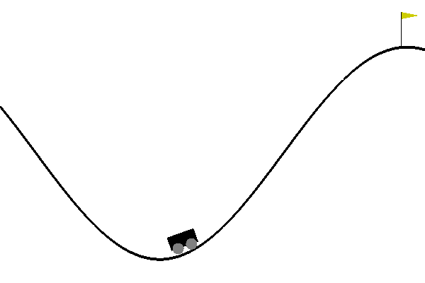
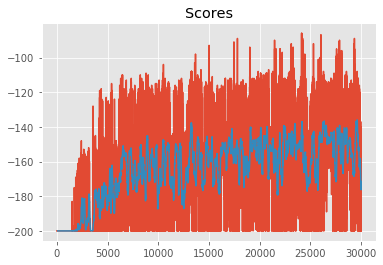
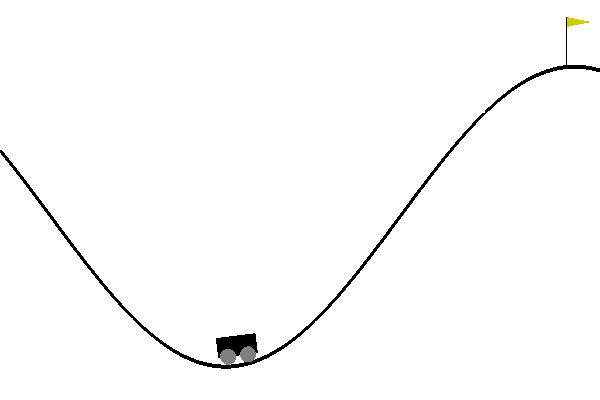
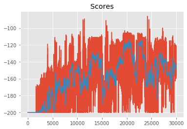
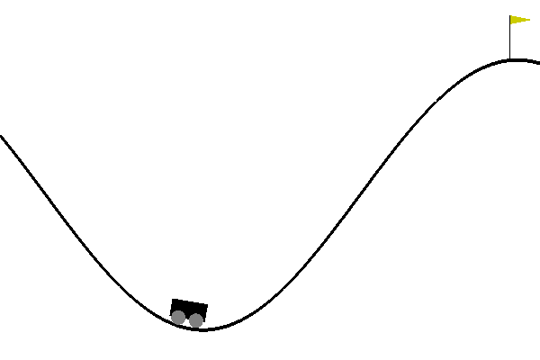
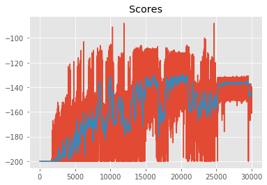

# Temporal-Difference

## Environment
- State Space = Box(2,) (Continuous Coordinates)
- Action Space = {0, 1, 2}

```
A car is on a one-dimensional track, positioned between two "mountains". The goal is to drive up the mountain on the right; however, the car's engine is not strong enough to scale the mountain in a single pass. Therefore, the only way to succeed is to drive back and forth to build up momentum.
```



## Discretizing the Continuous State Space to Discrete Space
As the RL methods like MC and TD works on discrete space, we have to convert the environment state spance into discrete space.


# Temporal-Difference methods
Agents were trained only for 30000 episodes.

- ## SARSA(0) or TD

### Sudo Code


### Scores


### Learned Agent


- ## SARSAMax or Q-learning
### Sudo Code


### Scores


### Learned Agent


- ## Expected SARSA
### Sudo Code


### Scores


### Learned Agent

